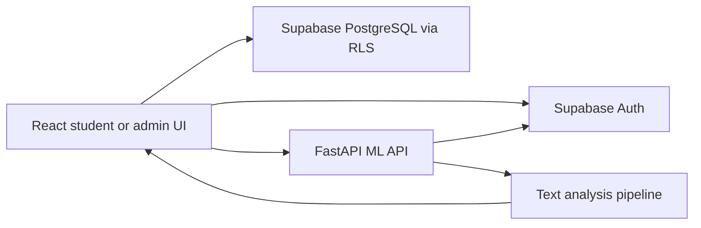

# Student Feedback

A responsive text-first student feedback platform. Students write natural-language feedback, while administrators review sentiment, topics, priority, trends, and follow-up actions.

## Tech stack

- Frontend: React 18, Vite, Recharts, responsive CSS
- Backend: Python, FastAPI, Uvicorn
- ML analysis: lightweight multilingual sentiment scoring, keyword topic detection, and rule-based priority scoring
- Data and authentication: Supabase PostgreSQL, Supabase Auth, Row Level Security
- Deployment: Vercel frontend and Vercel Python backend
- API: REST/JSON

The lightweight analyzer is intentional: the original Transformers/PyTorch model exceeded Vercel's 500 MB serverless function limit. The API preserves the same sentiment, confidence, scores, aspect, priority, and pipeline-stage response fields without the oversized runtime.

## Features

- Student signup and email confirmation
- Student login and private feedback history
- English and Telugu text input
- Automatic sentiment: positive, neutral, or negative
- Automatic topic detection: Teaching, Labs, Infrastructure, Canteen, Exams, Library, or General
- Automatic priority: High, Medium, or Low
- Protected HOD/Admin login (Password:Admin123)
- Admin dashboard with search, filters, charts, topic trends, and action tracking
- Student and admin password recovery through Supabase Auth email links
- Light and dark themes

## Admin access

Create the administrator in Supabase Auth rather than through student signup:

- Email: `admin@studentfeedback.in`
- Password: set this privately in Supabase Auth; do not commit it to GitHub

The application recognizes this reserved email as the admin account, and the database trigger creates its `profiles.role` as `admin`.

## Local setup

### Backend

```bash
cd backend
python -m venv .venv
# Windows: .venv\\Scripts\\activate
# macOS/Linux: source .venv/bin/activate
pip install -r requirements.txt
copy .env.example .env
python main.py
```

### Frontend

```bash
cd frontend
npm install
copy .env.example .env
npm run dev
```

Set `VITE_ML_API_URL=http://127.0.0.1:8000` for local development.

## Supabase setup

1. Run `supabase_schema.sql` in the Supabase SQL Editor.
2. Create the admin Auth user privately.
3. Enable Email Auth and custom SMTP if password emails are required.
4. Add the local and deployed `/reset-password` URLs under Auth URL Configuration.
5. Never expose a service-role key, SMTP password, or admin password in frontend code or GitHub.

## Deployment

The frontend is a Vite static deployment. The backend is a separate Vercel Python deployment using `backend/api/index.py` and `backend/vercel.json`.

### Live deployments

  https://student-feedback-app.vercel.app

  Note everyone cannot login into admin dashboard (admin means hod /Password is Admin123 )

Required frontend environment variables:

```text
VITE_SUPABASE_URL=https://your-project.supabase.co
VITE_SUPABASE_PUBLISHABLE_KEY=your-publishable-key
VITE_ML_API_URL=https://your-backend.vercel.app
```

Required backend environment variables:

```text
SUPABASE_URL=https://your-project.supabase.co
SUPABASE_PUBLISHABLE_KEY=your-publishable-key
FRONTEND_ORIGINS=https://your-frontend.vercel.app
```

The Vercel frontend deployment also includes `vercel.json` so direct auth callback routes resolve to `index.html`.

## Architecture



The browser never receives a service-role key. The ML API requires a Supabase bearer token and validates it through the Supabase Auth user endpoint before analyzing text.

## Repository layout

```text
student-feedback-analyzer/
├── backend/
│   ├── api/index.py          Vercel Python entrypoint
│   ├── main.py               FastAPI routes, auth validation, and CORS
│   ├── ml_pipeline.py        Sentiment, topic, and priority analysis
│   ├── requirements.txt      Backend dependencies
│   ├── vercel.json           Vercel function routing
│   └── Dockerfile            Container deployment option
├── frontend/
│   ├── src/App.jsx           Session and role routing
│   ├── src/pages/            Login, reset, student, and admin screens
│   ├── src/lib/supabase.js   Supabase browser client
│   ├── vercel.json            SPA fallback for direct routes
│   └── package.json           Frontend scripts and dependencies
├── supabase_schema.sql       Tables, trigger, helper function, and RLS
├── render.yaml               Optional Render container definition
└── start.sh                  Local two-service startup script
```

## Analysis pipeline

Every submitted message follows four stages:

1. `text_preprocessing`: lowercases, trims, preserves Telugu characters, and removes unsupported punctuation.
2. `lightweight_sentiment`: compares multilingual positive and negative terms and returns sentiment scores and confidence.
3. `keyword_aspect_detection`: matches wording to Teaching, Labs, Infrastructure, Canteen, Exams, Library, or General.
4. `rule_based_priority`: combines sentiment confidence with urgency terms such as `unsafe`, `broken`, `urgent`, and `unacceptable`.

The pipeline response has this shape:

```json
{
	"sentiment": "negative",
	"confidence": 0.67,
	"scores": {
		"positive": 0.165,
		"neutral": 0.165,
		"negative": 0.67
	},
	"aspect": "Infrastructure",
	"priority": "Medium",
	"pipeline_stages": [
		"text_preprocessing",
		"lightweight_sentiment",
		"keyword_aspect_detection",
		"rule_based_priority"
	]
}
```

## API reference

All analysis endpoints require:

```http
Authorization: Bearer <supabase-access-token>
Content-Type: application/json
```

### `GET /health`

Public service health check.

```json
{"status":"ok"}
```

### `POST /analyze`

Analyzes one feedback message. Text must contain at least five non-whitespace characters.

```json
{
	"text": "The internet is slow and the classroom projector is broken.",
	"subject": ""
}
```

### `POST /analyze-batch`

Analyzes multiple messages. Entries shorter than five characters are skipped.

```json
{
	"feedbacks": [
		{"id": "feedback-1", "text": "The library is helpful", "subject": ""}
	]
}
```

Common status codes:

| Status | Meaning |
| --- | --- |
| `200` | Analysis or health check succeeded |
| `401` | Missing, invalid, or expired Supabase token |
| `422` | Invalid request or text shorter than five characters |
| `503` | Analysis service failed while processing the request |

## Authentication flow

1. Students sign up with name, email, and password.
2. Supabase sends a confirmation email when email confirmation is enabled.
3. The confirmation link returns to the app origin.
4. On login, `App.jsx` loads the user profile and routes `student` users to `StudentPage` or `admin` users to `FacultyPage`.
5. Forgot Password calls `resetPasswordForEmail` and redirects to `/reset-password`.
6. The reset screen waits for Supabase's recovery session before calling `updateUser`.

Required Supabase Auth URL entries:

```text
https://your-frontend.vercel.app/reset-password
http://127.0.0.1:5173/reset-password
http://localhost:5173/reset-password
```

The Site URL should be the primary frontend URL, for example `https://your-frontend.vercel.app`.

## Database and security model

`supabase_schema.sql` creates:

- `profiles`: user identity and `student`/`admin` role.
- `feedbacks`: original message plus derived ML fields.
- `actions`: administrator follow-up records.
- `handle_new_user`: creates a profile after Auth signup.
- `is_admin`: a security-definer helper used by RLS policies.

Row Level Security rules ensure:

- Students can read only their own profile and feedback.
- Students can insert feedback only for their own user ID.
- Administrators can read all feedback and actions.
- Only administrators can insert actions for themselves.

Run the schema in the Supabase SQL Editor before using the dashboard. If login succeeds but the app immediately returns to sign in, check that the authenticated user has a matching `profiles` row.

## Deployment checklist

### Vercel frontend

1. Deploy the `frontend` directory as a Vite project.
2. Add `VITE_SUPABASE_URL` and `VITE_SUPABASE_PUBLISHABLE_KEY`.
3. Add `VITE_ML_API_URL` pointing to the public backend URL, never `localhost` or `127.0.0.1`.
4. Redeploy after changing environment variables because Vite embeds them at build time.

### Vercel backend

The lightweight backend can deploy as a Python function from the `backend` directory. Add `SUPABASE_URL`, `SUPABASE_PUBLISHABLE_KEY`, and `FRONTEND_ORIGINS`. The original Transformers/PyTorch model is intentionally not used in this deployment because it exceeds Vercel's function-size limit.

### Render or another container host

Use the supplied `Dockerfile` if a full Python container is preferred. Set the service root to `backend`, expose the host-provided `PORT`, and configure the same backend environment variables. Update `FRONTEND_ORIGINS` to the exact frontend origin.

## Troubleshooting

### `Failed to fetch` while submitting feedback

- Confirm `VITE_ML_API_URL` is a public HTTPS backend URL in the deployed frontend.
- Confirm `GET <backend-url>/health` returns `{"status":"ok"}`.
- Confirm the backend `FRONTEND_ORIGINS` contains the exact frontend origin.
- Rebuild and redeploy the frontend after changing its environment variables.

### `Auth session missing` on password reset

Open the reset link from the email directly. Do not manually visit `/reset-password` without the recovery token. Confirm the route is present in Supabase Auth URL Configuration.

### Admin login does not open the dashboard

Confirm the Auth user email is exactly `admin@studentfeedback.in`, the password is set in Supabase Auth, and the matching profile has `role = 'admin'`. Never create this account through the student signup form.

### Emails do not arrive

Enable Email Auth and configure SMTP in Supabase Authentication settings. For Gmail, use `smtp.gmail.com`, port `587`, the Gmail address as username, and a Gmail App Password. Never commit SMTP credentials.

## Security notes

- Only publish the Supabase publishable key in frontend environment variables.
- Never publish service-role keys, SMTP passwords, app passwords, access tokens, or admin passwords.
- Keep `.env` files local; only `.env.example` files belong in Git.
- Rotate any credential that has been pasted into chat, logs, commits, or public repositories.
